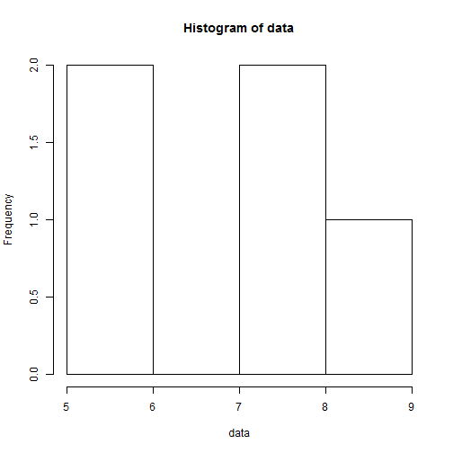
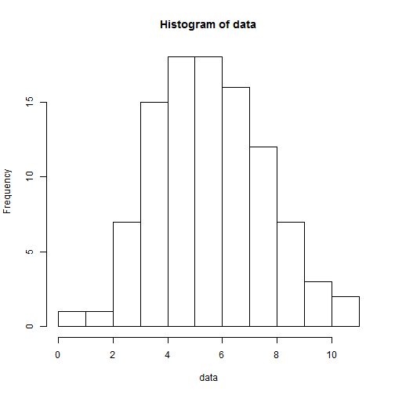

## About the Shiny application


* The application can be found [here](https://kenneth-lim.shinyapps.io/Project/).
* This application helps one to visualise the Central Limit Theorem through simulating multiple samples of a Binomial distribution, and provides documentation as to how the visualisation works.
* The available parameters to the user are:
    + The number of samples.
    + The number of observations in each sample.
    + The probability of a 'success' draw. 

---  

## How the application works

* Assume the user enters the following parameters in side panel. 

```r
input <- list()
input$nsamples <- 5
input$obs <- 20
input$p <- 0.3
```

* The application uses these values to generate 5 samples, each of 20 observations, with probability of 'success' being 0.3. 


```r
nsamples <- input$nsamples # obtain number of samples from ui.R 
obs <- input$obs # obtain number of obs from ui.R
p <- input$p # obtain p from ui.R
set.seed(123) # set seed for reproducibility
data <- replicate(nsamples, rbinom(1, obs, p)) # generate data
```


--- 

## Application returns a histogram of data generated


```r
hist(data)
```

 

---

## Observing the CLT in action

* By increasing the number of samples drawn, the user can observe that the distribution tends towards normality. Shown below is the histogram for nsamples = 100. 

 


